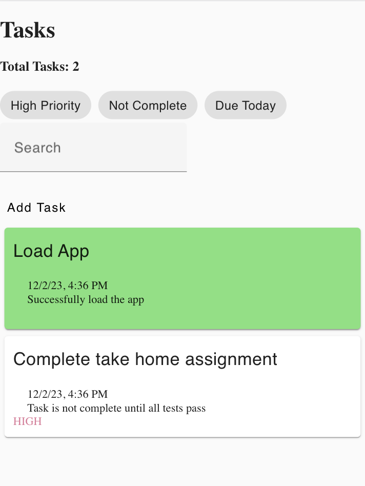

<h1 align="center">
  Tasks App
</h1>

## Test assignment

Create a task management application using Angular. The application now has a basic structure and some features. The goal is to improve the application by adding new features and improving the user experience. Key tasks include: adding tasks, filtering, search, date picker and UI/UX improvements.

### Evaluation criteria

Your assignment will undergo evaluation according to the following prioritized criteria:
- Functionality: Assessing whether the application fulfills specified requirements and if requested features are correctly implemented.
- Code Quality: Evaluating the organization, modularity, and adherence to best practices in Angular development.
- Testing: Verifying the presence of suitable unit tests that validate the functionality of implemented features.
- User Experience: Assessing the overall usability and design of the application.
