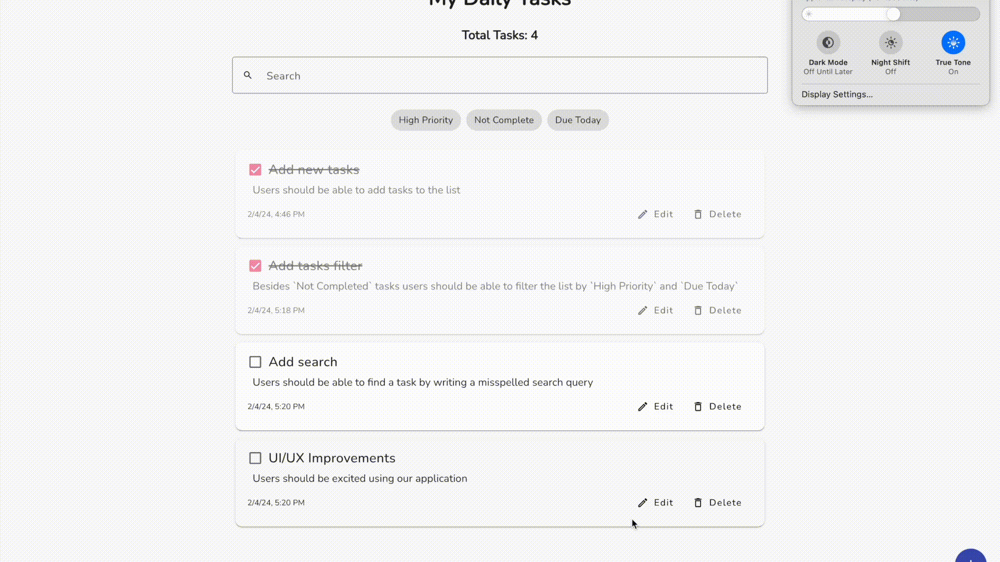

<h1 align="center">
  Tasks App
</h1>

  Online Demo: 
  <a href="https://vermillion-panda-bfdb03.netlify.app/">
    https://vermillion-panda-bfdb03.netlify.app/
  </a>

   

## Test assignment

Create a task management application using Angular. The application now has a basic structure and some features. The goal is to improve the application by adding new features and improving the user experience. Key tasks include: adding tasks, filtering, search, date picker and UI/UX improvements.

### Evaluation criteria

Your assignment will undergo evaluation according to the following prioritized criteria:

- Functionality: Assessing whether the application fulfills specified requirements and if requested features are correctly implemented.
- Code Quality: Evaluating the organization, modularity, and adherence to best practices in Angular development.
- Testing: Verifying the presence of suitable unit tests that validate the functionality of implemented features.
- User Experience: Assessing the overall usability and design of the application.

## Final result

The final result is a task management application that allows users to add, edit, filter, and search for tasks. The application also includes a date picker and a user-friendly interface.

All changes can be found in this pull request: [Develop -> Main](https://github.com/dtlnv/tasks-app/pull/3/files).

Online demo: [https://vermillion-panda-bfdb03.netlify.app/](https://vermillion-panda-bfdb03.netlify.app/).
